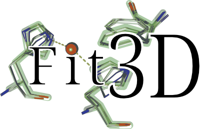

# Fit3D
Fit3D is a software for the template-based detection of substructure similarity in biological structure data.

 

## Background
The biological function of proteins and nucleic acids, such as riboswitches or ribozymes, relies on the correct arrangement of small substructural units to catalyze substrates, bind ligands, or to 
preserve an ordered state. These molecular building blocks have evolved to retain similar interaction patterns and geometrical features to ensure functionality. While some of these patterns are 
reflected in recurring sequence motifs, evolutionarily remote proteins may only share a small set of similar structural motifs, which are not obvious on sequence level. The Fit3D algorithm is a 
highly accurate search engine to detect substructure similarities based on a given template.

## Use Cases
- search for template structural motifs with known function in protein structures of unknown function (protein function prediction)
- identify remote homologous structures by the identification of substructure similarity
- similar binding site screening for drug development or drug repurposing

### Dependencies
The Fit3D software uses the fabulous [SiNGA](https://github.com/cleberecht/singa) framework, available on [Maven Central](https://mvnrepository.com/artifact/de.bioforscher.singa).

### Usage
An online version of Fit3D is available at [biosciences.hs-mittweida.de/fit3d](https://biosciences.hs-mittweida.de/fit3d/home). 
For detailed instructions on how to use the command line implementation please refer to the [wiki pages](https://github.com/enauz/mmm/wiki).

---

### Citation

If you use this software in your project, please cite:

>Kaiser, F, Eisold, A, Bittrich, S, Labudde, D (2016)
>
>Fit3D: a web application for highly accurate screening of spatial residue patterns in protein structure data.
>
>_Bioinformatics_, 32, 5:792-4., doi:10.1093/bioinformatics/btv637